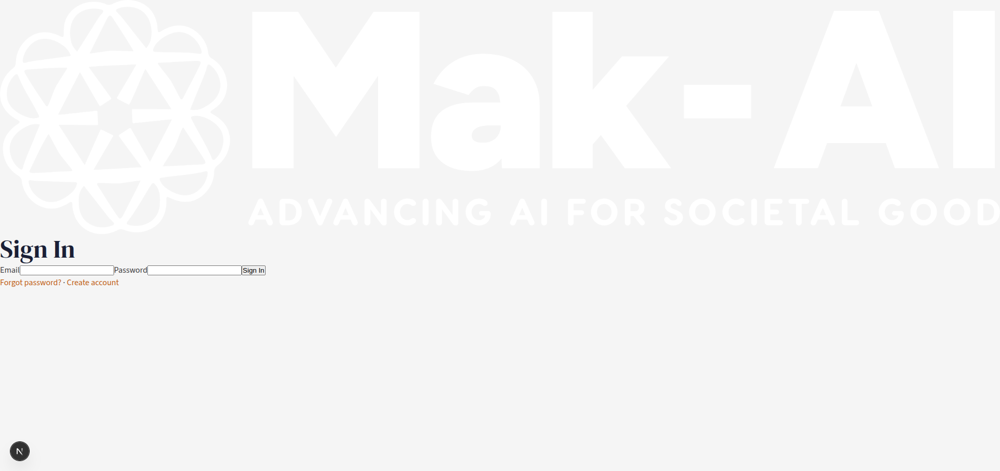
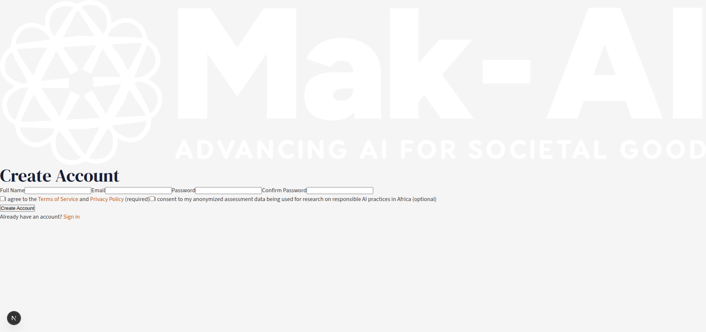
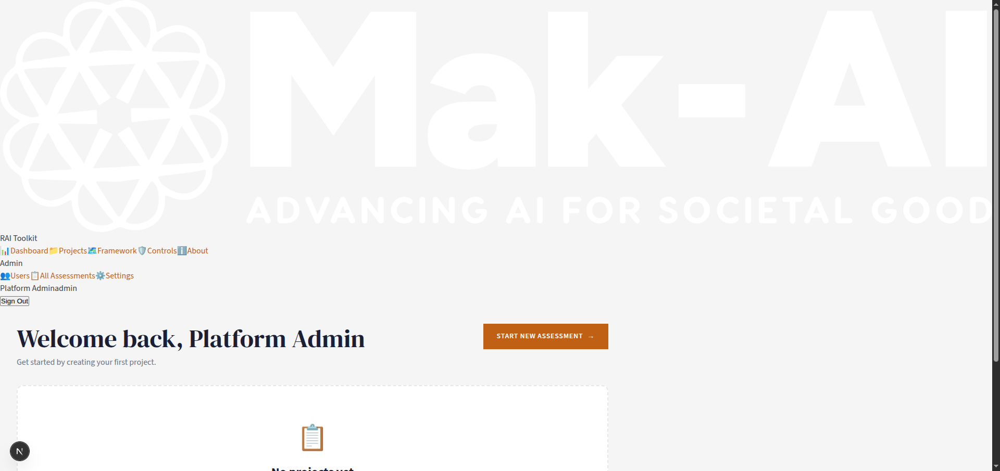
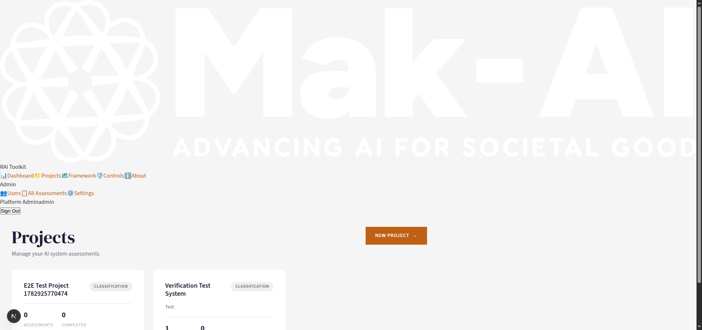
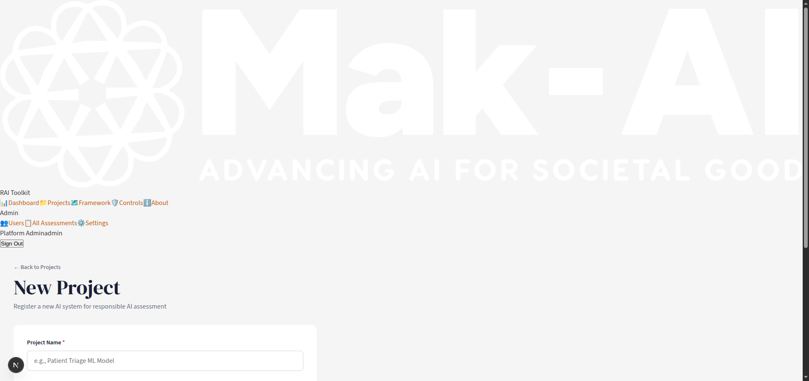
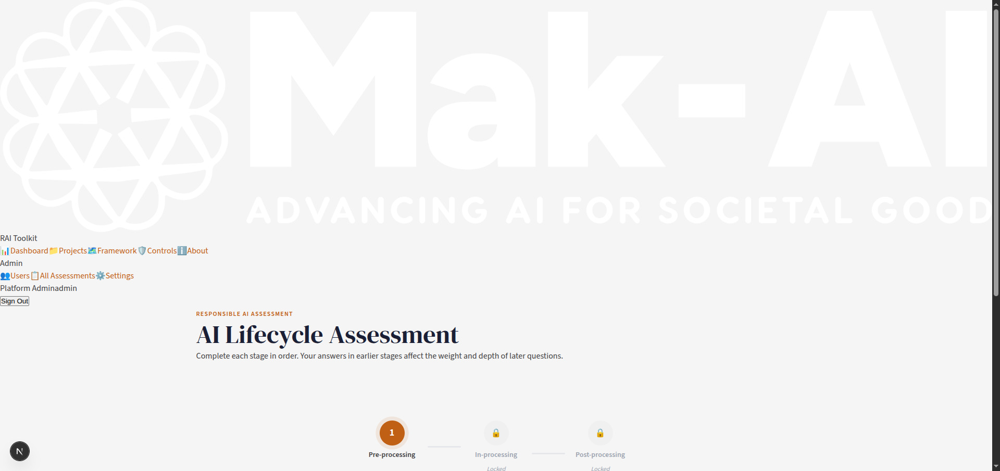
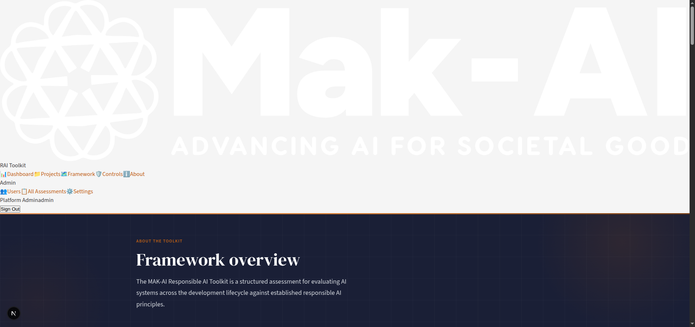

# UI/UX Audit Report — MAK-AI Responsible AI Toolkit

**Date:** 2026-07-02  
**Auditor:** Automated UI/UX Audit Agent  
**Platform:** MAK-AI Responsible AI Toolkit (Next.js)  
**URL:** `http://localhost:3000`  
**Methodology:** Chrome DevTools MCP — screenshots, DOM snapshots, CSS source analysis

---

## Executive Summary

The MAK-AI Responsible AI Toolkit has a **strong functional foundation** with well-organized routes, proper authentication, semantic HTML, and a thoughtful domain model (lifecycle-based assessments, controls library). However, the platform suffers from **critical CSS/styling gaps** that result in large portions of the UI rendering without any visual styling.

### Key Strengths
- Well-structured Next.js app with clear route organization (`(public)` vs `(authenticated)`)
- Comprehensive design token system in `globals.css` (colors, typography, spacing, shadows)
- Good semantic HTML: `<aside>`, `<nav>`, `<main>`, `<form>`, ARIA labels
- Rich feature set: lifecycle assessments, controls library, admin panel
- `prefers-reduced-motion` and `:focus-visible` accessibility support
- Print/PDF styles already defined

### Critical Issues
1. **Sidebar has zero CSS styles** — All `.sidebar-*` classes referenced in `Sidebar.tsx` have no CSS rules, causing the sidebar to render inline/horizontally
2. **Auth pages have zero CSS styles** — All `.auth-*` classes used by login/register pages have no CSS, leaving forms completely unstyled with browser defaults
3. **Layout wrappers have no CSS** — `.app-layout`, `.app-main`, `.public-layout` classes have no rules, breaking the grid layout
4. **White logo on white-ish background** — `logo-makai-white.png` is used everywhere on an `#F5F5F5` background, making the branding virtually invisible

**Overall Score: 2.0/5** — The design system is well-conceived but incompletely implemented.

---

## Page-by-Page Analysis

### 1. Login Page — `/login`



**DOM Structure:** `auth-container` > `auth-card` > `img.auth-logo` + `h1` + `form` + `auth-footer` links

| Category | Score | Notes |
|----------|-------|-------|
| Visual Design | 1/5 | Completely unstyled. Browser-default form inputs. White logo invisible on off-white background. |
| Layout | 1/5 | No centering, no card styling, no max-width constraint. Content hugs top-left. |
| Navigation | 3/5 | "Forgot password" and "Create account" links present and functional. |
| Interactive Elements | 1/5 | Native browser button, no hover states, no loading indicator visible. |
| Accessibility | 3/5 | `<label>` elements with `htmlFor`, `required` attributes, `role="alert"` for errors. |
| Consistency | 1/5 | Uses `btn-primary` class (not defined) vs `btn--primary` (defined but different). |

**Issues Found:**
- 🔴 **Critical:** No CSS rules for `.auth-container`, `.auth-card`, `.auth-logo`, `.auth-error`, `.auth-success`, `.auth-footer`, `.btn-primary` — see [login/page.tsx](file:///home/alvin/Downloads/MAK_RAI/toolkit-platform/app/(public)/login/page.tsx#L29-L46) and [globals.css](file:///home/alvin/Downloads/MAK_RAI/toolkit-platform/app/globals.css)
- 🔴 **Critical:** Logo uses `logo-makai-white.png` on `--color-off-white: #F5F5F5` background — nearly invisible — see [login/page.tsx:30](file:///home/alvin/Downloads/MAK_RAI/toolkit-platform/app/(public)/login/page.tsx#L30)
- 🟡 **Medium:** Password field uses `type="password"` but no show/hide toggle
- 🟡 **Medium:** No password requirements hint displayed

---

### 2. Registration Page — `/register`



**DOM Structure:** Similar to login but with Full Name, Email, Password, Confirm Password fields + checkboxes for ToS and research consent

| Category | Score | Notes |
|----------|-------|-------|
| Visual Design | 1/5 | Same unstyled issues as login. All 4 inputs render inline horizontally. |
| Layout | 1/5 | Form fields are not stacked vertically — all on one line. No spacing. |
| Navigation | 3/5 | "Sign in" link and ToS/Privacy links present. |
| Interactive Elements | 1/5 | Checkboxes are browser-default. No styled buttons. |
| Accessibility | 3/5 | Proper labels, `required` attrs, checkbox descriptions adequate. |
| Consistency | 1/5 | Same missing CSS class problems as login. |

**Issues Found:**
- 🔴 **Critical:** All form fields render horizontally in a single line instead of stacked vertically
- 🔴 **Critical:** Same missing CSS classes as login page
- 🟡 **Medium:** Checkbox label for ToS has invalid="true" in DOM (always shows as invalid)
- 🟢 **Low:** Research consent checkbox nicely marked as "(optional)" — good UX practice

---

### 3. Dashboard — `/dashboard`



**DOM Structure:** `app-layout` > `aside.sidebar` + `main.app-main` > page content with welcome message, CTA buttons, empty state

| Category | Score | Notes |
|----------|-------|-------|
| Visual Design | 2/5 | CTA button ("START NEW ASSESSMENT") is properly styled with brand orange. Empty state card has nice dashed border. But sidebar is unstyled. |
| Layout | 1/5 | Sidebar renders horizontally at top instead of as a vertical left sidebar. Navigation items flow inline. |
| Navigation | 3/5 | All nav links present and functional. Admin section separated with label. |
| Interactive Elements | 3/5 | CTA button has proper `.btn--primary .btn--arrow` styling. Sign Out button is unstyled. |
| Accessibility | 4/5 | `<aside>` landmark, `<nav aria-label="Main navigation">`, `<main>` landmark. Good structure. |
| Consistency | 2/5 | CTA buttons styled, but sidebar/layout completely unstyled. Mixed quality. |

**Issues Found:**
- 🔴 **Critical:** `.app-layout` has no CSS — should be a 2-column grid/flex (sidebar + main). See [layout.tsx:8](file:///home/alvin/Downloads/MAK_RAI/toolkit-platform/app/(authenticated)/layout.tsx#L8)
- 🔴 **Critical:** `.sidebar`, `.sidebar-header`, `.sidebar-nav`, `.sidebar-link`, `.sidebar-footer`, `.sidebar-signout` — all have zero CSS rules. See [Sidebar.tsx](file:///home/alvin/Downloads/MAK_RAI/toolkit-platform/components/layout/Sidebar.tsx)
- 🔴 **Critical:** White logo on off-white background in sidebar header
- 🟡 **Medium:** "Platform Adminadmin" — username and role text runs together without spacing. See [Sidebar.tsx:52-54](file:///home/alvin/Downloads/MAK_RAI/toolkit-platform/components/layout/Sidebar.tsx#L52-L54)
- 🟢 **Low:** Empty state message is good UX — guides new users to create their first project

---

### 4. Projects List — `/projects`



**DOM Structure:** Page header with "Projects" h1 + subtitle + NEW PROJECT CTA + `.projects-grid` with project cards

| Category | Score | Notes |
|----------|-------|-------|
| Visual Design | 3/5 | Project cards are styled with proper `.card` class. Badge for "CLASSIFICATION" properly styled. CTA button consistent. |
| Layout | 2/5 | Grid works (2-column for cards) but sidebar layout still broken. Cards have decent spacing. |
| Navigation | 4/5 | Cards are links to project detail. NEW PROJECT CTA prominent. |
| Interactive Elements | 3/5 | Cards have hover effects (shadow, translateY). CTA button styled. |
| Accessibility | 3/5 | Cards wrapped in `<a>` links with descriptive text. Stats use proper labels. |
| Consistency | 3/5 | Card design is consistent between project cards. Follows design system. |

**Issues Found:**
- 🔴 **Critical:** Sidebar layout still broken (same as all authenticated pages)
- 🟡 **Medium:** Project card titles could be truncated for very long names (e.g., "E2E Test Project 1782925770474")
- 🟢 **Low:** "by" and "Updated" metadata well-structured in cards

---

### 5. New Project Form — `/projects/new`



**DOM Structure:** Back link + h1 "New Project" + `.form-container` with form groups

| Category | Score | Notes |
|----------|-------|-------|
| Visual Design | 3/5 | Form container has proper `.form-container` styling (white bg, rounded, shadow). Labels styled. |
| Layout | 3/5 | Form fields properly stacked vertically within the form. Max-width constrained. Back link present. |
| Navigation | 4/5 | "← Back to Projects" link. CANCEL link returns to projects. |
| Interactive Elements | 4/5 | Placeholder text helps users. Expand/collapse for additional details. Select dropdown for AI System Type. |
| Accessibility | 4/5 | Required field asterisks, labeled inputs, form groupings. |
| Consistency | 3/5 | Form styling matches the design system's `.form-group` rules. |

**Issues Found:**
- 🔴 **Critical:** Sidebar layout broken (same across all pages)
- 🟡 **Medium:** "Optional — can be added later" note for additional details is nice touch
- 🟢 **Low:** Good placeholder text ("e.g., Patient Triage ML Model")

---

### 6. Project Detail — `/projects/{id}`

**DOM Structure (from snapshot):** Back link + h1 project name + description + "START NEW ASSESSMENT" CTA + "Project Details" section + "Assessments (1)" list

*Screenshot timed out — analysis from DOM snapshot only.*

| Category | Score | Notes |
|----------|-------|-------|
| Visual Design | 2/5 | Unable to visually verify, but DOM structure suggests proper content hierarchy. |
| Layout | 2/5 | Sidebar broken. Content appears to have proper sections (details + assessments list). |
| Navigation | 4/5 | Back to Projects link, assessment links, start new assessment CTA. |
| Interactive Elements | 3/5 | Assessment cards are links. Status badges ("IN PROGRESS", "FULL"). |
| Accessibility | 3/5 | h1 for project name, h2 for sections. Assessment items are links. |
| Consistency | 3/5 | Badge pattern reused (status badges). |

**Issues Found:**
- 🔴 **Critical:** Sidebar layout broken
- 🟡 **Medium:** Assessment version display "Assessment v1" — good practice
- 🟢 **Low:** Status badges ("IN PROGRESS") and mode badges ("FULL") provide good at-a-glance info

---

### 7. Assessment Page — `/assessment/{id}`



**DOM Structure:** "RESPONSIBLE AI ASSESSMENT" label + h1 "AI Lifecycle Assessment" + 3-stage progress (Pre-processing → In-processing → Post-processing) + stage cards

| Category | Score | Notes |
|----------|-------|-------|
| Visual Design | 3/5 | Stage progress indicator has nice circular numbered steps with connecting lines. Lock icons for locked stages. Brand orange for active stage. |
| Layout | 2/5 | Progress indicator is centered and well-structured. But sidebar layout is broken. |
| Navigation | 4/5 | Clear stage progression. "BEGIN ASSESSMENT →" CTA for active stage. Locked stages show prerequisite. |
| Interactive Elements | 3/5 | Active stage is a button. Locked stages show "Complete [previous] first" message. "START AGAIN" button at bottom. |
| Accessibility | 3/5 | Lock emoji 🔒 used (should be ARIA label instead). Stage headings present. |
| Consistency | 3/5 | `.text-accent` used for "RESPONSIBLE AI ASSESSMENT" label. Brand colors applied. |

**Issues Found:**
- 🔴 **Critical:** Sidebar layout broken
- 🟡 **Medium:** Lock icons use emoji 🔒 instead of accessible icons with aria-label
- 🟡 **Medium:** "Complete Pre-processing first" message could link to the prerequisite stage
- 🟢 **Low:** Nice progressive disclosure pattern — stages unlock sequentially

---

### 8. Framework Explorer — `/explore/framework`

**DOM Structure (from snapshot):** "21 ASSESSMENT AREAS · 3 LIFECYCLE STAGES" + h1 "Framework map" + 3 stage buttons (Pre-processing → In-processing → Post-processing)

*Screenshot timed out — analysis from DOM snapshot only.*

| Category | Score | Notes |
|----------|-------|-------|
| Visual Design | 2/5 | Cannot verify visually. Stats line is informative. |
| Layout | 2/5 | 3 buttons arranged with arrows between them. Sidebar broken. |
| Navigation | 3/5 | Stage buttons allow drilling into each lifecycle stage. |
| Interactive Elements | 3/5 | Buttons for each stage. Arrow (→) separators. |
| Accessibility | 3/5 | Descriptive text below heading. Buttons properly labeled. |
| Consistency | 3/5 | Stage labels match assessment page terminology. |

**Issues Found:**
- 🔴 **Critical:** Sidebar layout broken
- 🟡 **Medium:** Framework content appears minimal — only 3 buttons visible. Could benefit from visual map/diagram.

---

### 9. Controls Library — `/explore/controls`

**DOM Structure (from snapshot):** "RECOMMENDED CONTROLS" label + h1 "Controls Library" + count "28" + filter buttons (All/Technical/Procedural/Informational) + 28 control cards

*Screenshot timed out — analysis from DOM snapshot only.*

| Category | Score | Notes |
|----------|-------|-------|
| Visual Design | 3/5 | Filter buttons with counts. Control cards with IDs (C-01 through C-28), type labels, descriptions, and resource links. |
| Layout | 3/5 | Cards appear to be stacked vertically. Filter bar at top. Good content density. |
| Navigation | 4/5 | Filter by type. Each control has expandable "Show linked assessment areas". Template/Notebook links. |
| Interactive Elements | 4/5 | Filter buttons with counts (All 28, Technical 10, Procedural 16, Informational 2). Expand/collapse for linked areas. |
| Accessibility | 3/5 | Headings (h3) for each control. Descriptive text. Links properly labeled. |
| Consistency | 4/5 | Consistent card pattern across all 28 controls. Type badges (TECHNICAL, PROCEDURAL, INFORMATIONAL). |

**Issues Found:**
- 🔴 **Critical:** Sidebar layout broken
- 🟡 **Medium:** External notebook links go to GitHub (github.com/Alvin-Nahabwe/...) — should open in new tab
- 🟢 **Low:** Excellent content organization — filter + expand pattern works well for 28 controls

---

### 10. About Page — `/explore/about`



**DOM Structure (from snapshot):** "ABOUT THE TOOLKIT" label + h1 "Framework overview" + description text

| Category | Score | Notes |
|----------|-------|-------|
| Visual Design | 4/5 | Dark navy section (`section--dark`) provides visual contrast. White text on dark background is readable. |
| Layout | 3/5 | Content is centered with good max-width. Navy section breaks up the monotony. |
| Navigation | 2/5 | No internal navigation or table of contents for the about content. |
| Interactive Elements | 2/5 | Appears to be mostly static text content. |
| Accessibility | 3/5 | `.text-accent` label, proper heading hierarchy. |
| Consistency | 3/5 | Uses `.section--dark` from design system correctly. |

**Issues Found:**
- 🔴 **Critical:** Sidebar layout broken
- 🟡 **Medium:** About page appears quite minimal — could benefit from more content (team, methodology, references)
- 🟢 **Low:** Good use of the dark section for visual distinction

---

### 11. Admin: User Management — `/admin/users`

**DOM Structure (from snapshot):** h1 "User Management" + "12 registered users" + table with NAME/EMAIL/ROLE/JOINED/ASSESSMENTS/ACTIONS columns + user rows

*Screenshot timed out — analysis from DOM snapshot only.*

| Category | Score | Notes |
|----------|-------|-------|
| Visual Design | 2/5 | Table structure present but cannot verify visual styling. |
| Layout | 2/5 | Table-based layout for users. Column headers in uppercase. |
| Navigation | 2/5 | No pagination visible for 12 users. No search/filter. |
| Interactive Elements | 3/5 | "↑ PROMOTE" and "DEACTIVATE" buttons per user. "↓ DEMOTE" for admins. Buttons wrapped in `<form>` (server actions). |
| Accessibility | 3/5 | Button `description` attributes ("Promote to admin", "Deactivate user"). Clear role labels. |
| Consistency | 2/5 | Admin action buttons appear to be unstyled native buttons. |

**Issues Found:**
- 🔴 **Critical:** Sidebar layout broken
- 🟡 **High:** No search or filter for user list — will not scale
- 🟡 **High:** No confirmation dialog for destructive actions (DEACTIVATE, DEMOTE)
- 🟡 **Medium:** No pagination — 12 users is manageable, but won't scale
- 🟢 **Low:** Server-side form actions for mutations is a good pattern

---

### 12. Admin: Assessments Overview — `/admin/assessments`

**DOM Structure (from snapshot):** h1 "Assessments Overview" + "1 total assessment" + summary stats (TOTAL/COMPLETED/IN PROGRESS) + table (PROJECT/USER/MODE/SCORE/STATUS/DATE)

*Screenshot timed out — analysis from DOM snapshot only.*

| Category | Score | Notes |
|----------|-------|-------|
| Visual Design | 2/5 | Summary stats and table present. Cannot verify visual styling. |
| Layout | 2/5 | Stats row + data table. Sortable by date (▼ indicator). |
| Navigation | 3/5 | Links to individual assessments. Date sorting available. |
| Interactive Elements | 3/5 | Sort by date. Assessment row data shows email as secondary info. |
| Accessibility | 3/5 | Table headers clearly labeled. Status badges present. |
| Consistency | 3/5 | Table pattern matches user management. Status badges reused. |

**Issues Found:**
- 🔴 **Critical:** Sidebar layout broken
- 🟡 **Medium:** Score column shows "—" for in-progress assessments — unclear if score is computed on completion
- 🟢 **Low:** Summary stats (1 Total, 0 Completed, 1 In Progress) provide good overview

---

### 13. Admin: Platform Settings — `/admin/settings`

**DOM Structure (from snapshot):** h1 "Platform Settings" + "Platform Statistics" section (12 TOTAL USERS, 1 TOTAL ASSESSMENTS, — AVERAGE SCORE, 0% COMPLETION RATE) + "Assessment Completion" breakdown + "Question Bank" with "Coming Soon" placeholder

*Screenshot timed out — analysis from DOM snapshot only.*

| Category | Score | Notes |
|----------|-------|-------|
| Visual Design | 2/5 | Stats cards with large numbers and labels. Cannot verify visual styling. |
| Layout | 2/5 | Stats grid + breakdown section + coming soon placeholder. |
| Navigation | 2/5 | Limited — settings page is mostly read-only. |
| Interactive Elements | 1/5 | No interactive elements. "Coming Soon" for question bank editing. |
| Accessibility | 3/5 | Stats use heading hierarchy (h2, h3). Clear labels. |
| Consistency | 2/5 | "Coming Soon" section uses emoji 🔧 — should be an icon or removed. |

**Issues Found:**
- 🔴 **Critical:** Sidebar layout broken
- 🟡 **Medium:** "Coming Soon" placeholder for Question Bank — should indicate a timeline or link to feature request
- 🟡 **Medium:** No actual editable settings — page is read-only despite the name

---

## Cross-Cutting Issues

### 1. 🔴 Missing Sidebar CSS (Critical — affects ALL authenticated pages)

**Root Cause:** The [Sidebar.tsx](file:///home/alvin/Downloads/MAK_RAI/toolkit-platform/components/layout/Sidebar.tsx) component uses 12+ CSS class names that have **zero corresponding CSS rules** in [globals.css](file:///home/alvin/Downloads/MAK_RAI/toolkit-platform/app/globals.css):

| Missing Class | Used In | Purpose |
|---------------|---------|---------|
| `.sidebar` | Sidebar.tsx:26 | Root `<aside>` element |
| `.sidebar-header` | Sidebar.tsx:27 | Logo + title wrapper |
| `.sidebar-logo` | Sidebar.tsx:28 | Logo image sizing |
| `.sidebar-title` | Sidebar.tsx:29 | "RAI Toolkit" text |
| `.sidebar-nav` | Sidebar.tsx:31 | Navigation container |
| `.sidebar-link` | Sidebar.tsx:34 | Individual nav links |
| `.sidebar-link.active` | Sidebar.tsx:34 | Active page highlight |
| `.sidebar-icon` | Sidebar.tsx:35 | Emoji icon wrapper |
| `.sidebar-divider` | Sidebar.tsx:40 | Admin section separator |
| `.sidebar-section-label` | Sidebar.tsx:41 | "Admin" label |
| `.sidebar-footer` | Sidebar.tsx:51 | User info + sign out |
| `.sidebar-user` | Sidebar.tsx:52 | User name + role wrapper |
| `.sidebar-user-name` | Sidebar.tsx:53 | User display name |
| `.sidebar-user-role` | Sidebar.tsx:54 | User role label |
| `.sidebar-signout` | Sidebar.tsx:56 | Sign out button |

### 2. 🔴 Missing Layout CSS (Critical — affects ALL pages)

| Missing Class | Used In | Purpose |
|---------------|---------|---------|
| `.app-layout` | authenticated/layout.tsx:8 | 2-column grid wrapper |
| `.app-main` | authenticated/layout.tsx:10 | Main content area |
| `.public-layout` | public/layout.tsx:2 | Public page wrapper |

### 3. 🔴 Missing Auth Page CSS (Critical — affects login + register)

| Missing Class | Used In | Purpose |
|---------------|---------|---------|
| `.auth-container` | login/page.tsx:52 | Centering wrapper |
| `.auth-card` | login/page.tsx:29 | Card with form |
| `.auth-logo` | login/page.tsx:30 | Logo sizing |
| `.auth-error` | login/page.tsx:33 | Error message styling |
| `.auth-success` | login/page.tsx:32 | Success message styling |
| `.auth-footer` | login/page.tsx:43 | Footer links |
| `.btn-primary` | login/page.tsx:39 | Submit button (note: `.btn--primary` exists but `.btn-primary` does not) |

### 4. 🟡 White Logo on Light Background (High — affects ALL pages)

`logo-makai-white.png` is used on both public pages (off-white `#F5F5F5` background) and the sidebar. The logo is pure white and essentially invisible against the light background. Need either:
- A dark version of the logo for light backgrounds
- A colored/dark background behind the logo
- The sidebar to have a dark navy background (which would make the white logo appropriate)

### 5. 🟡 Emoji Icons Instead of Icon Library (Medium — affects sidebar + assessments)

Navigation uses raw emoji characters (📊, 📁, 🗺️, 🛡️, ℹ️, 👥, 📋, ⚙️) instead of a proper icon library. Issues:
- Inconsistent rendering across platforms/browsers
- Not styleable (no color/size control)
- Some emoji may not render on all systems
- Lock icon 🔒 on assessment page not accessible

### 6. 🟡 Missing `<title>` Consistency (Medium)

- Public pages: "MAK-AI Responsible AI Toolkit" (generic)
- Admin pages: "User Management — Admin", "Platform Settings — Admin" (better)
- Assessment/dashboard: "MAK-AI Responsible AI Toolkit" (generic)

---

## Scorecard

| Category | Score | Notes |
|----------|-------|-------|
| **Visual Design** | 2.0/5 | Strong design tokens defined but not applied to sidebar, layout, or auth pages. When applied (e.g., CTA buttons, cards), the design is cohesive. |
| **Layout & Spacing** | 1.5/5 | The 2-column sidebar layout is completely broken. Individual components (forms, cards) have good internal spacing when styled. |
| **Navigation & IA** | 3.5/5 | Well-organized nav structure with clear grouping (main + admin). Back links on subpages. Good route naming. |
| **Interactive Elements** | 2.5/5 | CTA buttons and card hover effects work well. Forms with `.form-group` are properly styled. But sidebar links, sign-out button, and auth forms are unstyled. |
| **Accessibility** | 3.5/5 | Strong semantic HTML (`<aside>`, `<nav>`, `<main>`, `<form>`), ARIA labels, `:focus-visible`, `prefers-reduced-motion`. Weakened by emoji-as-icons and missing contrast on logo. |
| **Consistency** | 2.0/5 | Design system exists and is thorough, but large gaps in implementation create a jarring split between styled and unstyled areas. |
| **Overall** | **2.5/5** | |

---

## Priority Recommendations

### 🔴 Critical (Fix Now)

1. **Add sidebar CSS to `globals.css`**  
   Define styles for all `.sidebar-*` classes. The sidebar should be a fixed-width, dark navy (`--color-navy`) vertical panel with the white logo, styled nav links, active state highlight, and footer with user info.

   ```css
   /* Example structure needed */
   .app-layout { display: grid; grid-template-columns: 260px 1fr; min-height: 100vh; }
   .sidebar { background: var(--color-navy); color: var(--color-white); display: flex; flex-direction: column; position: sticky; top: 0; height: 100vh; }
   .sidebar-link { display: flex; align-items: center; gap: var(--space-3); padding: var(--space-3) var(--space-4); color: var(--color-gray-400); }
   .sidebar-link.active { color: var(--color-white); background: rgba(255,255,255,0.1); border-left: 3px solid var(--color-primary); }
   ```

2. **Add auth page CSS to `globals.css`**  
   Define `.auth-container` (centered flex), `.auth-card` (white card with shadow, max-width ~440px), and style the form inputs.

   ```css
   .auth-container { min-height: 100vh; display: flex; align-items: center; justify-content: center; background: var(--color-navy); }
   .auth-card { background: var(--color-white); padding: var(--space-10); border-radius: var(--border-radius-lg); max-width: 440px; width: 100%; }
   ```

3. **Fix logo visibility**  
   Either use a dark-colored logo for light backgrounds, or ensure the sidebar has the navy background that makes the white logo appropriate. The auth pages should use the dark/colored logo on their white cards.

### 🟡 High (Fix Soon)

4. **Replace emoji navigation icons** with a proper icon library (Lucide, Heroicons, or similar) for cross-platform consistency and accessibility.

5. **Add confirmation dialogs** for destructive admin actions (DEACTIVATE user, DEMOTE admin).

6. **Add search/filter** to admin user management page to support scaling.

7. **Fix `.btn-primary` vs `.btn--primary` naming inconsistency** — login page uses `.btn-primary` but the design system defines `.btn--primary` with BEM convention.

### 🟡 Medium (Improve)

8. **Add page-specific `<title>` tags** — Dashboard should be "Dashboard — MAK-AI RAI Toolkit", Assessment should include project name, etc.

9. **Add pagination** to admin tables (users, assessments) for scalability.

10. **Add password show/hide toggle** on login and registration forms.

11. **Fix register form checkbox** — ToS checkbox shows `invalid="true"` in initial state.

12. **Add meaningful content to Framework explorer** — currently just 3 buttons, could include a visual lifecycle diagram.

13. **External links to GitHub notebooks** should open in new tabs (`target="_blank" rel="noopener"`).

14. **Responsive sidebar** — Add mobile hamburger menu for smaller viewports.

### 🟢 Low (Nice to Have)

15. **Add loading skeleton states** for pages that fetch data (projects, assessments).

16. **Add breadcrumbs** for deeper navigation (Project > Assessment > Stage).

17. **Add dark mode support** — the design tokens and navy palette are well-suited for a dark theme.

18. **Add tooltips** for admin action buttons to improve discoverability.

19. **Make Settings page actually editable** — currently it's read-only despite the name. Add ability to customize assessment parameters.

20. **Add a notification/toast system** for form submissions, status changes, etc.

---

## Source File References

| File | Purpose | Key Issues |
|------|---------|------------|
| [globals.css](file:///home/alvin/Downloads/MAK_RAI/toolkit-platform/app/globals.css) | All styles (1,267 lines) | Missing sidebar, auth, layout classes |
| [Sidebar.tsx](file:///home/alvin/Downloads/MAK_RAI/toolkit-platform/components/layout/Sidebar.tsx) | Sidebar component | Uses 15+ undefined CSS classes |
| [authenticated/layout.tsx](file:///home/alvin/Downloads/MAK_RAI/toolkit-platform/app/(authenticated)/layout.tsx) | Auth layout wrapper | `.app-layout` class undefined |
| [public/layout.tsx](file:///home/alvin/Downloads/MAK_RAI/toolkit-platform/app/(public)/layout.tsx) | Public layout wrapper | `.public-layout` class undefined |
| [login/page.tsx](file:///home/alvin/Downloads/MAK_RAI/toolkit-platform/app/(public)/login/page.tsx) | Login page | `.auth-*` classes undefined, `.btn-primary` mismatch |
